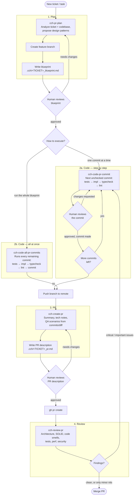

# CCH Ideal Workflow

This diagram shows how the five CCH skills are meant to be chained together, from
picking up a ticket to getting a PR merged. Each skill is a separate Codex
invocation — you move to the next one manually once you're happy with the output
of the current one.

## Notes on the flow

- **Plan (`cch-pr-plan`)** is the only skill allowed to touch `.cch/<TICKET>_blueprint.md`
  before code exists — no implementation happens until a human approves the blueprint.
- **Code** has two interchangeable paths that both read from the same blueprint:
  - `cch-code-pr-commit` — one commit per invocation, with a human sign-off before
    each individual commit. Best when the change is risky or exploratory.
  - `cch-code-all-pr-commits` — runs every remaining commit in one session and
    defers all human review to the PR stage. Best for well-scoped, low-risk blueprints.
- **PR (`cch-create-pr`)** only writes a description from what's already committed —
  it never changes code.
- **Review (`cch-review-pr`)** can be invoked independently of this pipeline (e.g. a
  teammate reviewing someone else's PR), but in the ideal end-to-end flow it's the
  final gate before merge. Critical/Important findings loop back into another round
  of `cch-code-pr-commit`; Minor findings don't block merging.
